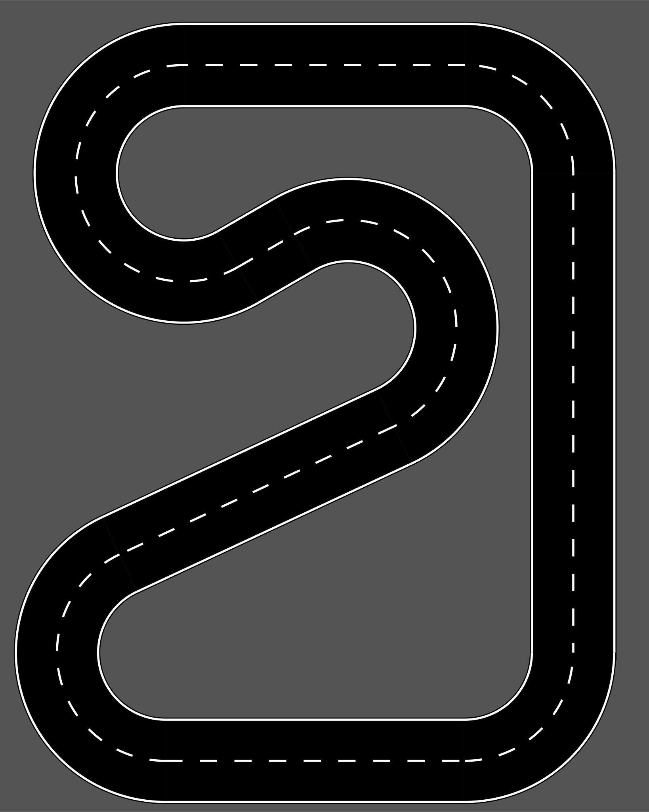

[](https://GitHub.com/race-against-ai/raai_tracks/commit/)  

# Tracks  

This repository contains tracks for **Holodeck** and **IdeenExpo 2024** generated using the [Track Generator Tool](https://github.com/twyleg/track_generator).  

## Track Generator  

The **Track Generator** is used to create tracks for the car.  

### How to Run the Tool  

Follow these steps to generate tracks:  

1. Set up a Python virtual environment:  
   ```bash
   python -m venv venv
   source venv/bin/activate
   ```  

2. Install dependencies:  
   ```bash
   pip install -r requirements.txt
   ```  

3. Generate the track:  
   ```bash
   track_generator generate_track_live TRACK_FILE
   ```  

For more information, refer to the [Track Generator repository](https://github.com/twyleg/track_generator).  

## Available Tracks  

### Holodeck  

Track design for use in the **Holodeck** are located in the `output/holodeck/` directory.  

Example:  
  

### IdeenExpo 2024  

Track created for the **IdeenExpo 2024** can be found in the `output/ideenexpo_2024/` directory.  
